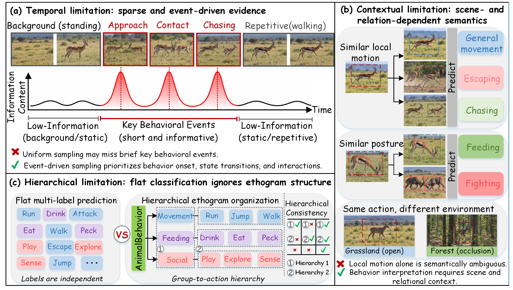
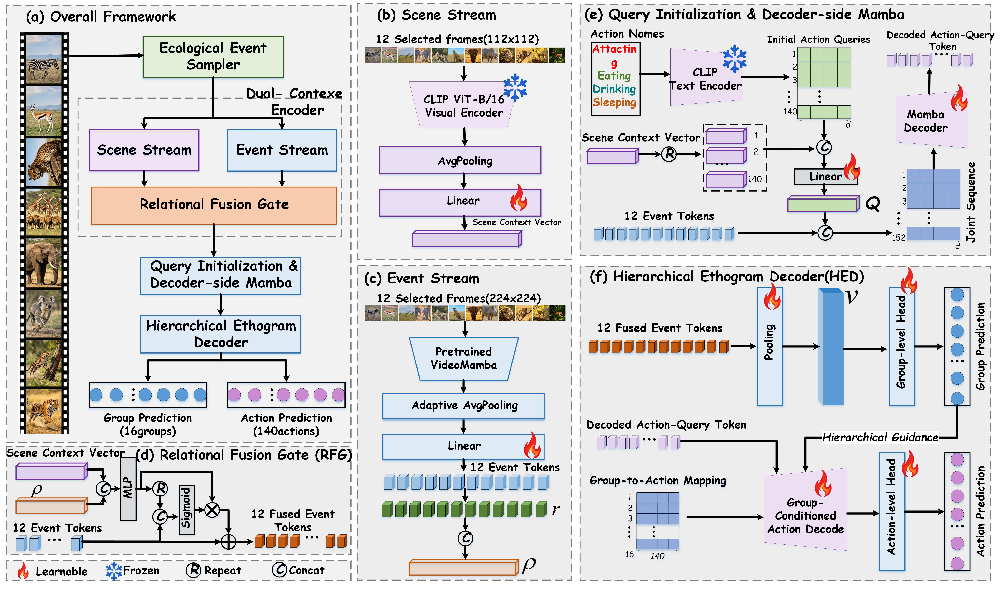

# Eco-Mamba: Ecology-Aware Adaptive Mamba for Animal Action Recognition

Official implementation of **Eco-Mamba: Ecology-Aware Adaptive Mamba for Animal Action Recognition**. Eco-Mamba treats animal behaviour recognition as ecology-aware multi-label inference: it allocates a fixed frame budget to behavioural events, interprets events with scene and relation context, and produces ethogram-consistent action predictions.

## Overview



**Figure 1 — Ecological motivation.** Animal-action evidence is often temporally sparse, depends on scene and inter-animal relations, and follows an ethogram hierarchy. Eco-Mamba explicitly models these three properties instead of treating every frame and action label independently.



**Figure 2 — Eco-Mamba architecture.** EES first selects representative event frames under a fixed budget. The Dual-Context Encoder extracts event and scene representations, RFG injects scene-relation context into event tokens, and HED jointly predicts behaviour groups and fine-grained actions.

The implementation includes:

- **Ecological Event Sampler (EES):** motion transition, novelty, relation activation, and observation uncertainty select a fixed number of event frames.
- **Dual-Context Encoder + Relational Fusion Gate (RFG):** VideoMamba event tokens are conditioned on frozen CLIP scene features and lightweight relation descriptors.
- **Hierarchical Ethogram Decoder (HED):** jointly predicts 16 Animal Kingdom behaviour groups and 140 fine-grained actions, with a consistency loss.

## Environment

The reported experiments used Python, PyTorch, CUDA, and an NVIDIA RTX 3090. Create an environment with a CUDA-compatible PyTorch build, then install the project dependencies:

```bash
pip install -r requirements.txt
```

`mamba-ssm` and `causal-conv1d` compile CUDA extensions. Match the PyTorch/CUDA versions to your machine; installation requires a CUDA compiler if no compatible wheel is available.

## Data and initialization

This repository intentionally excludes datasets and model weights from Git. Download Animal Kingdom from the [official dataset website](https://sutdcv.github.io/Animal-Kingdom/) or consult the [official GitHub repository](https://github.com/sutdcv/Animal-Kingdom). For this project, download the **action-recognition annotations** and the `action_recognition/dataset/image.tar.gz` frame archive, then extract them into the layout below (or pass another location with `--data-root`):

```text
Animal_Kingdom/
└── action_recognition/
    ├── annotation/
    │   ├── train_light.csv
    │   └── val_light.csv
    └── dataset/image/<video_id>/<frame>.jpg
```

**No trained Eco-Mamba checkpoints are released with this repository.** Users should train their own model with the commands below. The paper configuration initializes from public VideoMamba K400 weights; if you independently obtain them, place them in `pretrained/` using these exact filenames:

```text
videomamba_t16_k400_f16_res224.pth
videomamba_s16_k400_f16_res224.pth
videomamba_m16_k400_f16_res224.pth
```

By default, the CLIP model is loaded from `openai/clip-vit-base-patch16`. To run fully offline, download it first and pass its directory with `--clip-model-path /path/to/clip-vit-base-patch16`. To train without VideoMamba initialization, add `--no-videomamba-pretrained`.

## Training

The paper setting uses 12 EES-selected frames, a 16-layer decoder, 100 frozen-backbone epochs, and 150 joint fine-tuning epochs:

```bash
python train.py \
  --dataset animalkingdom \
  --data-root Animal_Kingdom \
  --videomamba-version m \
  --num-frames 12 \
  --sampling-strategy ees \
  --decoder-layers 16 \
  --freeze-backbone-epochs 100 \
  --finetune-backbone-epochs 150 \
  --batch-size 8 \
  --group-loss-weight 1.0 \
  --hier-loss-weight 0.2 \
  --save-path checkpoints/eco_mamba_m12_ees.pth
```

